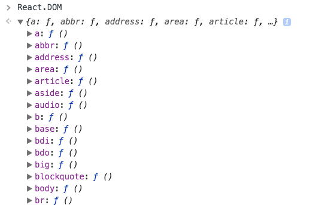

A component is one isolated piece of interface. For example in a typical blog homepage you might find the Sidebar component, and the Blog Posts List component. They are in turn composed of components themselves, so you could have a list of Blog post components, each for every blog post, and each with its own peculiar properties.


React makes it very simple: everything is a component.

Even plain HTML tags are component on their own, and they are added by default.

The next 2 lines are equivalent, they do the same thing. One with **JSX**, one without, by injecting `<h1>Hello World!</h1>` into an element with id `app`.

```js
import React from 'react'
import ReactDOM from 'react-dom'

ReactDOM.render(<h1>Hello World!</h1>, document.getElementById('app'))

ReactDOM.render(
  React.DOM.h1(null, 'Hello World!'),
  document.getElementById('app')
)
```

See, `React.DOM` exposed us an `h1` component. Which other HTML tags are available? All of them! You can inspect what `React.DOM` offers by typing it in the Browser Console:



(the list is longer)

The built-in components are nice, but you'll quickly outgrow them. What React excels in is letting us compose a UI by composing custom components.

## Custom components

There are 2 ways to define a component in React.

A function component:

```js
const BlogPostExcerpt = () => {
  return (
    <div>
      <h1>Title</h1>
      <p>Description</p>
    </div>
  )
}
```

A class component:

```js
import React, { Component } from 'react'

class BlogPostExcerpt extends Component {
  render() {
    return (
      <div>
        <h1>Title</h1>
        <p>Description</p>
      </div>
    )
  }
}
```

Up until recently, class components were the only way to define a component that had its own state, and could access the lifecycle methods so you could do things when the component was first rendered, updated or removed.

React Hooks changed this, so our function components are now much more powerful than ever and I believe we'll see fewer and fewer class components in the future, although it will still be perfectly valid way to create components.

There is also a third syntax which uses the `ES5` syntax, without the classes:

```js
import React from 'react'

React.createClass({
  render() {
    return (
      <div>
        <h1>Title</h1>
        <p>Description</p>
      </div>
    )
  }
})
```

You'll rarely see this in modern, `> ES6` codebases.
