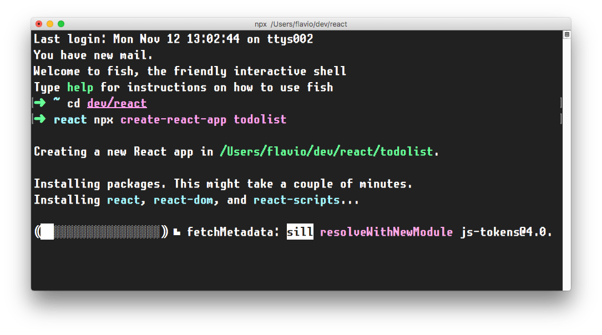
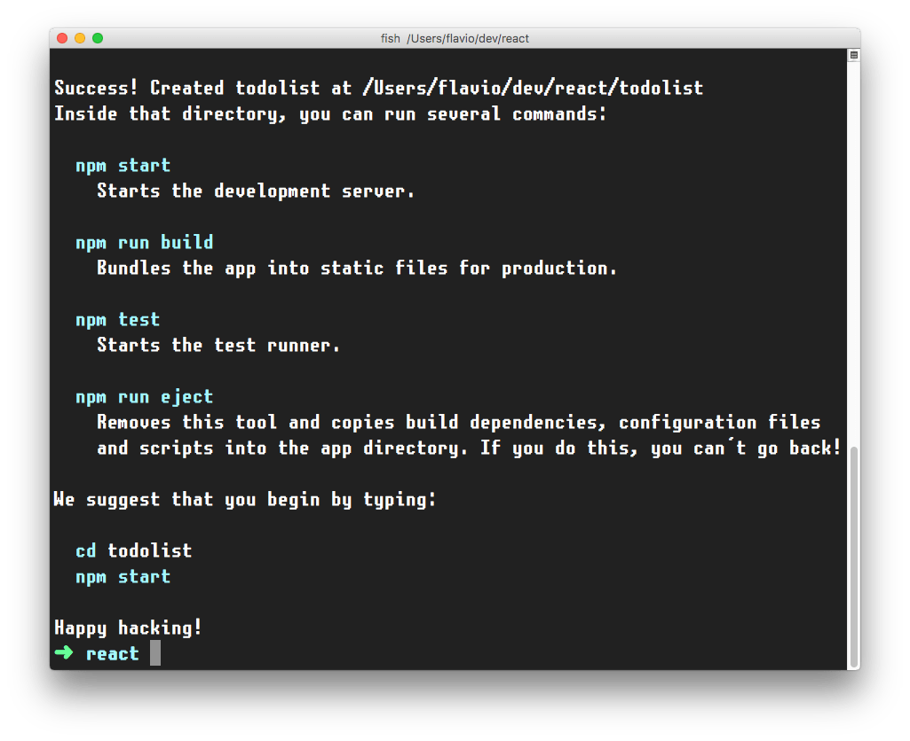
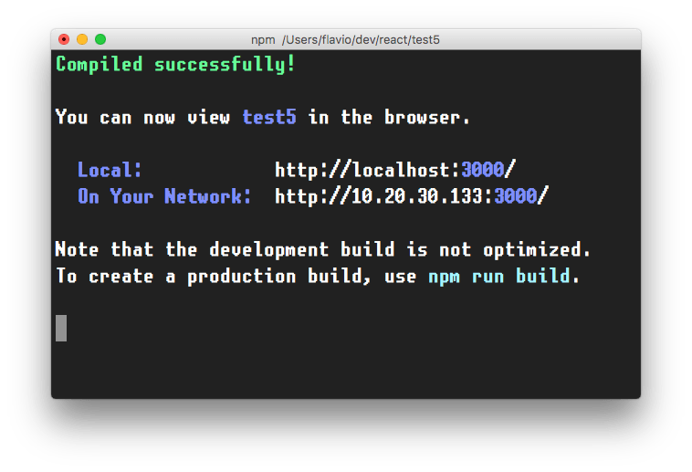

[`create-react-app`](https://github.com/facebook/create-react-app) is a project aimed at getting you up to speed with React in no time. It provides a ready-made React application starter, so you can dive into building your app without having to deal with Webpack and Babel configurations.

It provides out of the box:

- a development server with hot reloading
- provides a testing environment with Jest
- allows to build the React app
- ready for ES6+ syntax
- bundles all your JavaScript and assets
- comes with CSS autoprefixer, SASS and CSS Modules support
- and more!

You start by using [`npx`](/npx/), which is an easy way to download and execute Node.js commands without installing them. `npx` comes with `npm` (since version 5.2) and if you don't have npm installed already, do it now from <https://nodejs.org> (npm is installed with Node).

If you are unsure which version you have, I recommend checking out if you need to update.

> Tip: check out my terminal tutorial at <https://flaviocopes.com/macos-terminal/> if you're unfamiliar with it

When you run `npx create-react-app <app-name>`, `npx` is going to _download_ the most recent `create-react-app` release, run it, and then remove it from your system. This is great because you will never have an outdated version on your system, and every time you run it, you're getting the latest and greatest code available.

Let's start then:

```sh
npx create-react-app todolist
```



This is when it finished running:



`create-react-app` created a files structure in the folder you told (`todolist` in this case), and initialized a [Git](/git/) repository.

It also added a few commands in the `package.json` file, so you can immediately start the app by going into the folder and run `npm start`.




In addition to `npm start`, `create-react-app` added a few other commands:

- `npm run build`: to build the React application files in the `build` folder, ready to be deployed to a server
- `npm test`: to run the testing suite using [Jest](/jest/)
- `npm eject`: to eject from `create-react-app`

Ejecting is the act of deciding that `create-react-app` has done enough for you, but you want to do more than what it allows.

Since `create-react-app` is a set of common denominator conventions and a limited amount of options, it's somewhat guaranteed that at some point your needs will require you something unique that outgrows the capabilities of `create-react-app`.

When you eject, you lose the ability of automatic updates but you gain more flexibility in the [Babel](/babel/) and [Webpack](/webpack/) configuration.

When you eject the action is irreversible. You will get 2 new folders in your application directory, `config` and `scripts`. Those contain all the configuration you need and now you can start editing it.