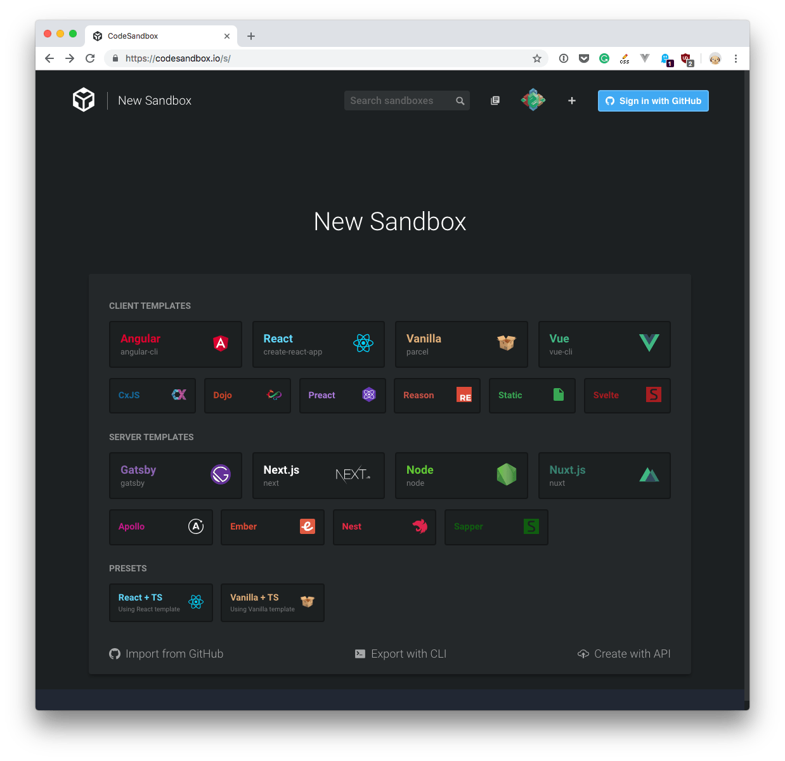

How do you install React?

React is a library, so saying _install_ might be a bit weird. Maybe _setup_ is a better name, but you got the concept.

There are various ways to have React ready to be used on your app or site.

## Load React directly in the web page

The simplest one is to add the React JavaScript file into the page directly. This is best when your React app will interact with the elements present on a single page, and not actually controls the whole navigation aspect.

In this case, you add 2 script tags to the end of the `body` tag:

```html
<html>
...
<body>
  ...
  <script src="https://cdnjs.cloudflare.com/ajax/libs/react/16.7.0-alpha.2/umd/react.development.js" crossorigin></script>
  <script src="https://cdnjs.cloudflare.com/ajax/libs/react-dom/16.7.0-alpha.2/umd/react-dom.production.min.js" crossorigin></script>
</body>
</html>
```

> The `16.7.0-alpha.2` version in the links points to the latest Alpha of 16.7, which has Hooks available. Please change it to the latest version of React you see now available.

Here we loaded both React and React DOM. Why 2 libraries? Because React is 100% independent from the browser and can be used outside it (for example with on Mobile devices with React Native). Hence the need for React DOM, to add the wrappers for the browser.

After those tags you can load your JavaScript files that use React, or even inline JavaScript in a `script` tag:

```html
<script src="app.js"></script>

<!-- or -->

<script>
  //my app
</script>
```

To use [JSX](/jsx/) you need an extra step: load [Babel](/babel/)

```html
<script src="https://unpkg.com/babel-standalone@6/babel.min.js"></script>
```

and load your scripts with the special `text/babel` MIME type:

```html
<script src="app.js" type="text/babel"></script>
```

Now you can add JSX in your app.js file:

```js
const Button = () => {
  return (
    <button>
      Click me!
    </button>
  )
}

ReactDOM.render(
  <Button />,
  document.getElementById('root')
)
```

Check out this simple Glitch example: <https://glitch.com/edit/#!/react-example-inline-jsx?path=script.js>

Starting in this way with script tags is good for building prototypes and have a quick start without having to set up a complex workflow.

## Use create-react-app

`create-react-app` is a project aimed at getting you up to speed with React in no time, and any React app that is going to outgrow a single page is going to be use it.

You start by using [`npx`](/npx/), which is an easy way to download and execute Node.js commands without installing them. `npx` comes with `npm` (since version 5.2) and if you don't have npm installed already, do it now from <https://nodejs.org> (npm is installed with Node).

If you are unsure which version of npm you have, run `npm -v` to check if you need to update.

> Tip: check out my OSX terminal tutorial at <https://flaviocopes.com/macos-terminal/> if you're unfamiliar with using the terminal, applies to Linux as well - I'm sorry but I don't have a tutorial for Windows at the moment, but Google is your friend.

When you run `npx create-react-app <app-name>`, `npx` is going to _download_ the most recent `create-react-app` release, run it, and then remove it from your system. This is great because you will never have an outdated version on your system, and every time you run it, you're getting the latest and greatest code available.

Let's start then:

```sh
npx create-react-app todolist
```


This is when it finished running:


`create-react-app` created a files structure in the folder you told (`todolist` in this case), and initialized a [Git](/git/) repository.

It also added a few commands in the `package.json` file, so you can immediately start the app by going into the folder and run `npm start`.


In addition to `npm start`, `create-react-app` added a few other commands:

- `npm run build`: to build the React application files in the `build` folder, ready to be deployed to a server
- `npm test`: to run the testing suite using [Jest](/jest/)
- `npm eject`: to eject from `create-react-app`

Ejecting is the act of deciding that `create-react-app` has done enough for you, but you want to do more than what it allows.

Since `create-react-app` is a set of common denominator conventions and a limited amount of options, it's somewhat guaranteed that at some point your needs will require you something unique that outgrows the capabilities of `create-react-app`.

When you eject, you lose the ability of automatic updates but you gain more flexibility in the [Babel](/babel/) and [Webpack](/webpack/) configuration.

When you eject the action is irreversible. You will get 2 new folders in your application directory, `config` and `scripts`. Those contain all the configuration you need and now you can start editing it.

> If you already have a React app installed using an older version of React, first check the version by adding `console.log(React.version)` in your app, then you can update by running `yarn add react@16.7`, and yarn will prompt you to update (choose the latest version available). Repeat for `yarn add react-dom@16.7` (change "16.7" with whatever is the newest version of React at the moment)

## CodeSandbox

An easy way to have the `create-react-app` structure, without installing it, is to go to <https://codesandbox.io/s> and choose "React".



CodeSandbox is a great to start a React project without having to install it locally.

## Codepen

Another great solution is [Codepen](https://codepen.io).

You can use this Codepen starter project which already comes pre-configured with React, with support for Hooks: <https://codepen.io/flaviocopes/pen/VqeaxB>

Codepen "pens" are great for quick projects with one JavaScript file, while "projects" are great for projects with multiple files, like the ones we'll use the most when building React apps.

One thing to note is that in Codepen, due to how it works internally, you don't use the regular ES Modules `import` syntax, but rather to import for example `useState`, you use

```js
const { useState } = React
```

and not

```js
import { useState } from 'react'
```